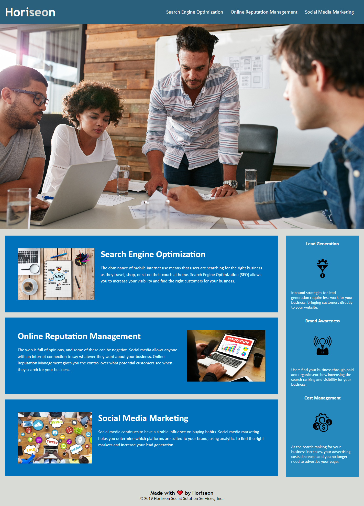

# bootcamp
>Use for module 1

>Focus was to clean up code where possible; to simplify, fix any errors found, and make personal touches based off accessibility and presentation.

>Issues encountered: View and elements shifting depending on screen size, attempted to fix with undesirable results.

Site Preview:

>Colors used: #ffffff, #2a607c, #0072bb